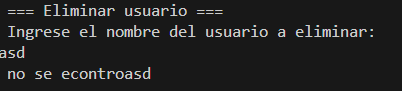
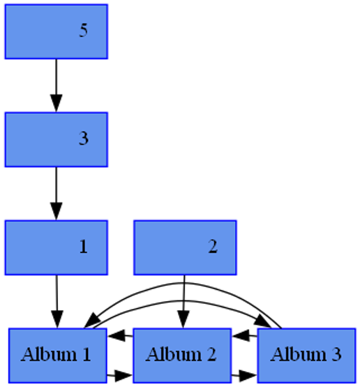

# Manual de usuario

## Objetivo general

● Aplicar los conocimientos del curso Estructuras de Datos en el desarrollo de
soluciones de software.

## Objetivos específicos

● Aplicar los conocimientos adquiridos sobre estructuras de datos lineales y no
lineales como matrices y árboles

● Implementar una aplicación de escritorio utilizando el lenguaje de programación
Fortran

● Familiarizarse con la lectura y escritura de archivos de JSON.

● Utilizar la herramienta Graphviz para graficar estructuras de datos no lineales.

● Definir e implementar algoritmos de búsqueda, recorrido y eliminación en estructuras
de datos.

## Descripción

Se desarrolla una aplicación en consola que pueda ejecutarse independientemente del
sistema operativo de la pc, por lo que se propone crear una aplicación de consola en el
lenguaje de programación Fortran, esta aplicación debe permitir a los clientes de la
empresa Pixel Print Studio registrar imágenes especiales construidas por capas. Para poder
hacer uso de la aplicación el cliente debe registrarse.
La principal funcionalidad de la aplicación consiste en un generador de imágenes
por capas, la aplicación contará con un conjunto de capas cargadas previamente y
almacenadas en memoria para ser utilizadas, estas capas se utilizarán para generar
imágenes hechas con pixeles, cada capa contendrá la información de los distintos
píxeles y al colocar una capa sobre otra estas irán formando una imagen más
completa.
El sistema es capaz de generar imagen seleccionando las capas deseadas.

## Menu de la aplicación

La aplicación tiene un menú principal con 3 opciones, las cuales se pueden ver a continuación:

Si se escoge la opción de inicio de sesion, el programa perdira que se ingrese el nombre de usuario y contraseña. En caso de que sea el administrador entrara a un menu, si es un usuario entrara a otro menu. Y si el cliente no esta registrado se le pedira que se registre.

## Menú de administrador

El menú administrador tiene las siguientes opciones:

### 1. Arbol B de usuarios (Grafico)

Primero se debe de cargar el archivo json que contiene los usuarios, caso contrario no se podra mostrar el arbol B de usuarios.

### 2. Crear nuevo usuario

Al crear un nueo ususario se pediran los siguientes datos:

### 3. Modificar usuario

Para poder modificarun usuario se debe de ingresar su DPI, si no se encuantra el usuario se mostrara un mensaje de error. Caso contrario se debera de ingresar los datos solicitados para cambiar los datos del usuario.

### 4. Eliminar usuario

Para poder eliminar un usuario se debe de ingresar su nombre, si no se encuantra el usuario se mostrara un mensaje de error. Caso contrario se eliminara el usuario.

### 5.Carga masiva de usuarios

Al escoger esta opción se debe de ingresar la dirección Json del archivo de clientes.

### 6.Salir

Como su nombre indica es la opción que permite salir del menu de administrador y regresar al menu principal.

## Menú de usuario

Inicialmente se deben de cargar las capas, imagenes y albumes, para poder hacer uso de las opciones del menu de usuario.

### 1. Visualizar reportes de las estructuras

Esta opción abrira los arhivos png de las estructuras de capas, imagenes y albumes.

### 2. Generacion de imagen por capa

Al escoger estaopción se pedira al usuario que ingrese el numero total de capas a graficar, para posteriormente ingresar las capas que se desean graficar.

El proceso de creación de la imagen puede llevar un tiempo.

imagen generada:

### 3. Generacion de imagen en Preorden

Al generar la imagen con este recorrido se genera la imagen haciendo un recorrido en preorden. Este proceso es un poco más lento que generar las imagenes por capa.

### 4. Generacion de imagen en Inorden

Al generar la imagen con este recorrido se genera la imagen haciendo un recorrido en inorden. Este proceso es un poco más lento que generar las iamgenes por capa.

### 5. Generacion de imagen en Postorden

Al generar la imagen con este recorrido se genera la imagen haciendo un recorrido en postorden. Este proceso es un poco más lento que generar las imagenes por capa.

### 6. Carga masiva de capas

Al escoger esta opción se debe de ingresar la dirección Json del archivo de capas. si el archivo se carga correctamente se mostrara un mensaje de exito y se abrira el archivo png que contiene la EDD que contiene las capas.

### 7. Carga masiva de imagenes

Al escoger esta opción se debe de ingresar la dirección Json del archivo de imagenes. si el archivo se carga correctamente se mostrara un mensaje de exito y se abrira el archivo png que contiene la EDD que contiene las imagenes.

### 8. Cargar masiva de albumes

Al escoger esta opción se debe de ingresar la dirección Json del archivo de albumes. si el archivo se carga correctamente se mostrara un mensaje de exito y se abrira el archivo png que contiene la EDD que contiene los albumes.

### 9. Reporte: ListarCapas (preorder,inorder y postorder)

Esta opción imprimira por consola la lista de capas en las diferentes formas de recorrido. (preorder,inorder y postorder)

### 10. Salir

Al igual que con el menu de administrador, esta opción sirve para regresar al menu principal.
