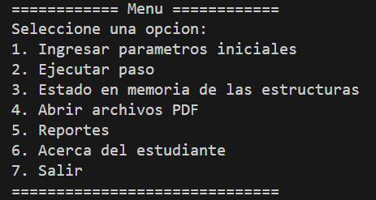
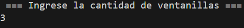
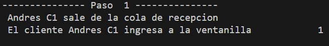
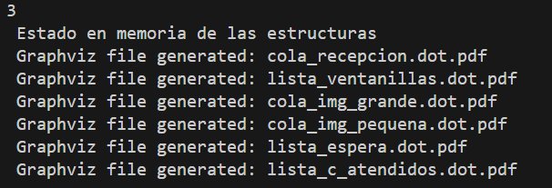
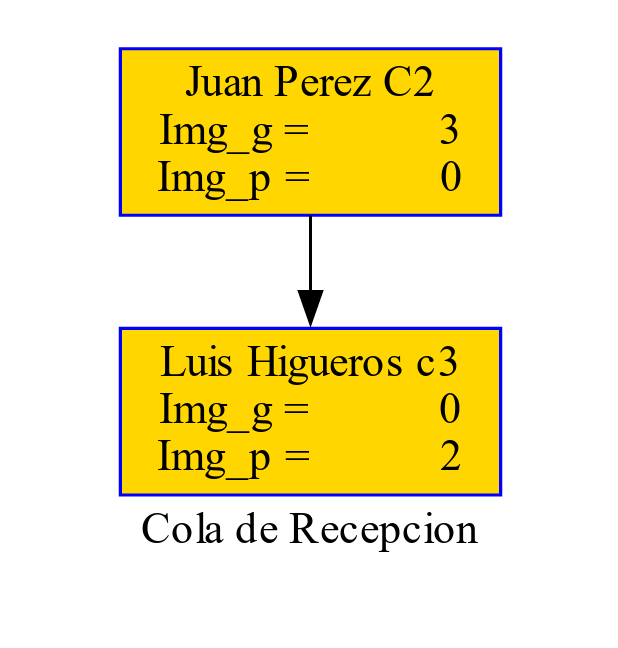
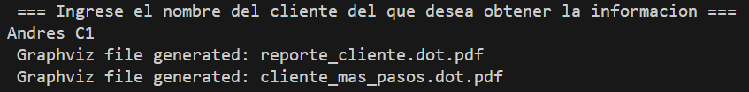
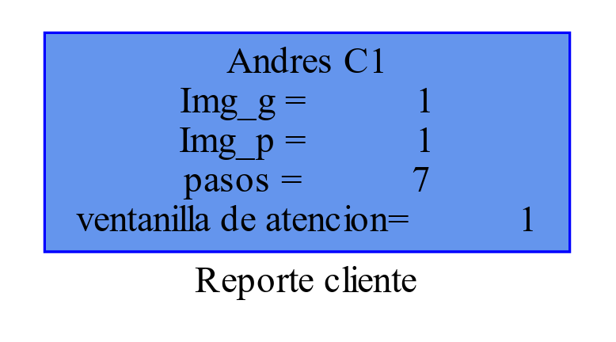
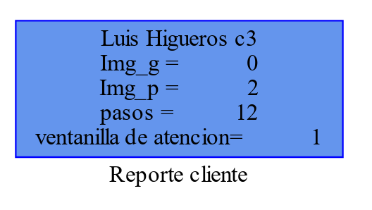
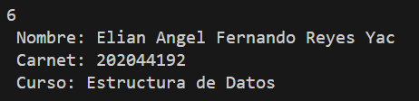
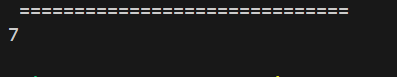

# Manual de usuario

## OBJETIVO GENERAL

Desarrollar una aplicación que optimice la manipulación de información mediante la
aplicación efectiva de los conocimientos adquiridos en el curso de Estructuras de
Datos.

## OBJETIVOS ESPECÍFICOS

- **Aplicación Práctica de Estructuras de Datos Lineales:**
  - Demostrar la comprensión y aplicación de las estructuras de datos lineales a través
    de una aplicación de simulación que refleje de manera efectiva los procesos de la
    empresa.
- **Implementación en Fortran:**
  - Utilizar el lenguaje de programación Fortran para implementar y gestionar
    eficientemente las estructuras de datos lineales, aprovechando las características
    específicas del lenguaje en el desarrollo de la aplicación.
- **Visualización con Graphviz:**
  - Integrar la herramienta Graphviz para generar representaciones visuales claras y
    comprensibles de las estructuras de datos lineales utilizadas en la simulación,
    facilitando así la comprensión del funcionamiento interno de la aplicación.
- **Definición e Implementación de Algoritmos:**
  - Definir algoritmos específicos de búsqueda, recorrido y eliminación adaptados a las
    necesidades de la simulación, asegurando una manipulación eficiente de la
    información en todas las etapas del proceso.

## Menu de la aplicación

La aplicación cuenta con 7 opciones, las cuales se pueden ver a continuación:

### 1. Ingresar parametros iniciales

Esta opción es indispensable, ya que si no se ingresan parametros iniciales el programa no podra funcionar adecuadamente.

Al escoger esta opción el programa pedira que se ingrese la dirección del archivo Json que se va a usar y el número de ventanillas.

### 2. Ejecutar paso

Esta opción como su nombre loindica permite avanzar un paso en la ejecución del programa, esto debido a que el programa no realiza todas las acciones de una vez si no que se debe de seleccionar la opción 2 para que avance un paso y asi se realizen los procesos necesarios en cada estructura.

ej:

### 3. Estado en memoria de las estructuras

Esta opción crea graficos, en diferentes archivos con la ayuda de Graphviz que permiten visualizar en cualquier momento el estado de las estructuras, en algunos casos el archivo estara vacio lo cual indica que no hay nada en esa estrucuura.

Ejemplo estructura temporalmete vacia:

### 4. Abrir archivos PDF

Esta opción va de la mano con la opción 3, ya que abre todos los archivos pdf creados con la opción 3, esto es util para evitar buscar cada pdf y abrirlo manualmente.

### 5. Reportes

La opción de reportes genera dos archivos, uno es el cliente atendido con el mayor número de pasos y el otro sera un archivo con los datos de algun cliente atendido que ingrese el usuario.

Ej graficos:

Cliente con más pasos:

### 6. Acerca del estudiante

Esta opción muestra en consola diferentes datos del estudiante, entre ellos nombre, carnet, y curso

### 7.Salir

Como su nombre indica, sirve para salir del programa.

